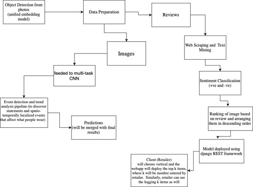
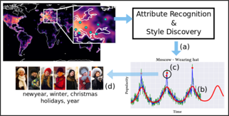
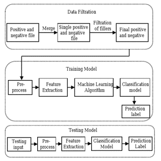
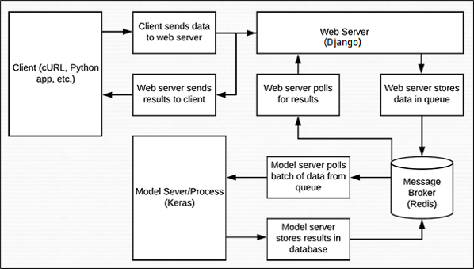

# Holy-Shit-It-Worked

Flipkart Grid 2.0 Software Development Challenge Submission

Checkout the Video Explanation of the repository at:- 

## Project Overview:

In this project , an automatic framework that extracts winning apparels from major online fashion portals and online magazines in a consumable and actionable format, so that it is easy for offline retailers to identify the ongoing and upcoming fashion trending styles.

## Simple block diagram of service/components:

## Solution choices for each sub-problem:

**For sub-problem 1 i.e. object detection**, a unified embedding model system is used instead of using fine-grained/instance recognition, separate models for different verticals. While using separate models can help improve accuracy, it brings extra burden for model storage and deployment. Our unified embedding model model can achieve comparable retrieval accuracy as separate models, with the model complexity no bigger than a single specialized model. Also, unified embedding model is scalable. 

Inception V2 is used as the base network, chosen mainly for efficiency reasons

**For sub-problem 2 i.e. discover and forecast long-term trends of various fashion attributes**
 
(a) Attribute recognition and style discovery on internet images from multiple cities gives us temporal trends. 
 
(b) We fit interpretable parametric models to these trends to characterize and forecast   (red curve is the fitted trend used to forecast). 
 
(c) Deviations from parametric models are identified as events (red points). 
 
(d) We identify text and styles specific to each event.

Multi-task CNN (GoogLeNet) is used for this purpose.

**For sub-problem 3 i.e. Sentiment Classification from product reviews**, 
the method usee is as follows:

**For sub-problem 4 i.e. Deploying the ML model, Django REST framework is used.**

The data flow is as follows:

**Link to the repository containing web-app** - https://github.com/kvothemaedre/FrontEnd-Flipkart.git 
